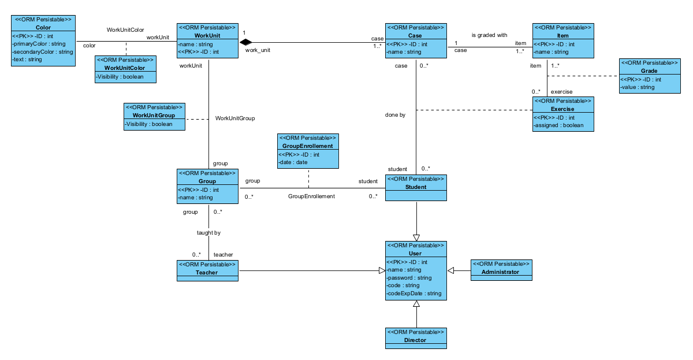

# MetaHospitalFP

<!-- TABLE OF CONTENTS -->
<details>
  <summary>Table of Contents</summary>
  <ol>
    <li>
      <a href="#introduction">Introduction</a>
    </li>
    <li>
      <a href="#about-the-project">About The Project</a>
    </li>
    <li>
      <a href="#technical-specifications">Technical specifications</a>
    </li>
    <li>
      <span>Diagrams</span>
      <ul>
        <li><a href="#use-case-diagram">Use case diagram</a></li>
        <li><a href="#class-diagram">Class diagram</a></li>
        <li><a href="#class-diagram">Entity-relation diagram</a></li>
      </ul>
    </li>
    <li><a href="#usability-and-accessibility">Usability and accessibility</a></li>
    <li><a href="#figma-prototype">Figma prototype</a></li>
    <li><a href="#user-requirements">User requirements</a></li>
    <li>
      <span>Getting started</span>
      <ul>
        <li><a href="#prerequisites">Prerequisites</a></li>
        <li><a href="#installation">Installation</a></li>
        <li><a href="#open-the-project">Open the project</a></li>
      </ul>
    </li>
    <li><a href="#organization">Organization</a></li>
    <li><a href="#technology-stack">Technology-stack</a></li>
    <li><a href="#conclusion">Conclusion</a></li>
    <li><a href="#contact">Contact</a></li>
  </ol>
</details>

# Introduction

This project is an application about the administration an creation of activities and assigments of 
students, teachers and more, the objective is to create a system that can be used by all users in the school. 

This app will have different modules for each role (teacher, student, director, guest ... ). In the application, actions can be performed for each role. Among these, we can highlight the creation of activities for teachers, in addition to being able to assign students to their courses. On the other hand, we would emphasize the possibility of creating courses and assigning teachers and students to these courses, this being done by administrators.

As seen in the previous paragraph, the need arises to facilitate the management and viewing of students' grades, as they can quickly access their pending activities and exercises. This enables them to easily manage the courses assigned to teachers.

The project is not developed for a specific company; it is a public project. However, recommendations and assistance are provided by Fidenet, and for the development of another section of the application, the company Scott&Irwin is involved.

In conclusion, the main idea is to develop an easy-to-use and intuitive application for use in an educational setting.

# About The Project

To provide context for the upcoming diagrams, we will explain in more detail the actions that users will perform in the app.

This project is an application about the administration of activities, the users have some roles like students, that can complete exercises and read files and see their punctuations in the activities.

The teachers can assign activities and exercises to their students. The last user is the administrator, he is the only user that can create cases, which will be assigned to students by their teachers and can assign students and teachers to a classroom.

The cases will be evaluated based on a set of criteria ("Items"). The criteria will be used to determine the grade for each case.

In addition, there will be a guest user. This guest user will only be able to access public cases.
Any changes they make will not be saved to the database.

# Technical specifications

The application follows a client-server architecture. On the frontend, React is employed—a JavaScript library for building interactive and efficient user interfaces. On the backend, Node.js, in conjunction with Express, is used to simplify the creation of APIs and web applications. The relational database MySQL manages data storage and retrieval.

#### Progressive Web App (PWA)

The application is designed as a Progressive Web App (PWA), providing an optimal user experience even in poor network conditions. By adopting PWA best practices, enhanced security, offline functionality, and the option to be installed on devices are ensured, thereby improving accessibility and user experience.

#### Security

Security measures are implemented to ensure user information protection:

- **Secure Authentication:** The application uses JSON Web Tokens (JWT) to authenticate and authorize users, ensuring the privacy of information.
- **Server-Side Validation:** Validation controls are applied on the backend to prevent potential vulnerabilities and ensure data integrity.
- **Proper Error Handling:** Robust error handling has been incorporated to protect against potential attacks and ensure application stability.

to see more details about the technologies used clic <a href='#technology-stack'>here</a>

# Diagrams

### Use case diagram

As explained in the previous section, we visually illustrate in the following diagram all the actions that each of the roles can perform.

<div style="text-align: center; height: fit-content; margin: 20px 0">
  
</div>

### Class diagram

<div style="text-align: center; height: fit-content; margin: 20px 0">
  
</div>

Thanks to the class diagram, we can start identifying the different
entities that need to be created to create the database. However,
we still need one last diagram, which is the Entity-Relation diagram, in than diagram I will explain in detail all the entities and relations

### Entity-relation diagram

<div style="text-align: center; height: fit-content; margin: 20px 0">
  
</div>

The design of the entity-relationship (E/R) model is customized to support the management of activities and exercises within an educational environment. The subsequent sections elaborate on the E/R structure, its entities, relationships, as well as considerations and modifications made to ensure the application's flexibility and scalability.

### Users
The "Users" entity encompasses various roles within the application, including administrators, teachers, directors, and students. Each user can be affiliated with a course, and for students, the date of course enrollment is stored to manage repetitions.

**Relationships:**
- **Users-Courses:** Establishes a relationship assigning users (teachers and students) to courses.
- **Students-Exercises:** Designates the assignment of exercises to students by the faculty of their respective courses.

### Course Evaluation
Course evaluation involves three components: "Items," representing evaluation criteria for a case, and "Grades," where student grades are recorded. Each exercise is linked to a case, and grades are correlated with "Items" to identify the evaluated aspects.

**Entities:**
- **Items:** Represents the evaluation criteria for a case.
- **Grades:** Stores student grades, correlated with "Items."

### Work Units and Colors
"Work Units" establish connections between cases and courses, enabling teachers to access student evaluations. The introduction of the "Color" entity allows the assignment of identifying colors to work units, enhancing accessibility and promoting intuitive navigation.

**Relationships:**
- **Work Units-Courses:** Forms a relationship connecting cases with courses.
- **Work Units-Colors:** Establishes a relationship for assigning identifying colors to work units.


### Relational model

<div style="text-align: center; height: fit-content; margin: 20px 0">
  
</div>

<p align="right">(<a href="#metahospitalfp">back to top</a>)</p>

## Considerations for the Future

**Separation of the Users table:**
The Users table has been separated to adapt to specific fields for each type of user, allowing empty fields according to the role.

**Roles and Users in Separate Tables:**
The creation of separate tables for roles is proposed, allowing greater flexibility of permissions between users and facilitating access management to different pages of the application.


### Scalability:
Designed with future expansions in mind, avoiding unnecessary modifications to existing fields and tables.

### Customization of Colors:
The "Color" table has been incorporated to enable customization of course colors, considering a future section for teachers to customize the interface.

## Additional Proposals to Enhance the Model

### Course History for Students

**Proposal:** Add a "CourseHistory" entity to store the courses a student has taken over time.

**Justification:** Facilitate tracking and management of students' academic progression, offering a complete history of completed courses.

### Communication Module

**Proposal:** Introduce a "Communication" entity to manage communication between teachers, students, and administrators.

**Justification:** Improve interaction within the application, allowing messages, announcements, and notifications among different roles, contributing to a more collaborative and efficient experience.

### Activity Records

**Proposal:** Include "ActivityRecords" and "ExerciseRecords" entities to maintain a history of activities and exercises performed by students.

**Justification:** Facilitate analysis and tracking of individual student progress, providing detailed information on activities performed.

### Audit of Changes

**Proposal:** Implement an audit mechanism to record changes in the database, such as permission modifications, course creation, or exercise assignment.

**Justification:** Provide transparency and traceability, crucial for change management and identifying potential security issues.

### Enhancements in Customization

**Proposal:** Expand customization by allowing teachers to define additional fields for courses and exercises.

**Justification:** Increase the versatility of the application by adapting to specific needs of each course, giving teachers more control over the structure of information.

### Calendar Integration

**Proposal:** Integrate a "Calendar" entity to manage events, deadlines, and important dates related to courses and activities.

**Justification:** Improve planning and coordination, providing users with a comprehensive view of academic events and relevant deadlines.

These proposals integrate into the existing project to enrich functionality, adapting it to evolving educational needs and providing a more comprehensive and customizable experience.

<p align="right">(<a href="#metahospitalfp">back to top</a>)</p>

# Figma prototype

Once that I have a first view of the application, I can start to create the prototype, to create it I used Figma, here is the prototype. [Figma prototype]

# Usability and accessibility

Los formularios están validados proporcionando sus respectivos mensajes al usuario, entre los mensajes que podemos ver en este caso, el inicio de sesión son:

- message when a field is empty:

In this message the empty fields fill the border in red to show the user exactly where is the problem: 

<div style="text-align: center; height: fit-content; margin: 20px 0">
  
  
</div>

- message when the user is not found:

<div style="text-align: center; height: fit-content; margin: 20px 0">
  
</div>

- message when there is no connection to the server:

<div style="text-align: center; height: fit-content; margin: 20px 0">
  
</div>

The last two images has error control, the first the error is generated in the backend an is catched in the frontend to show the message and the last one is generated when the user try to get informacion from the backend and there is no response:

<div style="text-align: center; height: fit-content; margin: 20px 0">
  
   
</div>

##

After that, when the user is correctly logged it shows a success message like this:

<div style="text-align: center; height: fit-content; margin: 20px 0">
  
</div>

##

Another aspect is the interfaces, which are simple and uncluttered, in addition to being intuitive with pleasant colors and good contrast between text, buttons, and the background. Here, we present several images of interfaces for different types of users:

<div style="text-align: center; height: fit-content; margin: 20px 0">
  
  
  
</div>

The interfaces are also responsive, allowing them to adapt to various devices, including mobile phones:

<div style="text-align: center; height: fit-content; margin: 20px 0">
  
  
  
</div>

##

Furthermore, for options that can significantly impact data, a confirmation message is displayed to allow the user to cancel the action:

<div style="text-align: center; height: fit-content; margin: 20px 0">
  
  
</div>

<p align="right">(<a href="#metahospitalfp">back to top</a>)</p>

##

Other aspects of accessibility are tested with Lighthouse, it gives a max punctuation of 100:

<div style="text-align: center; height: fit-content; margin: 20px 0">
  
</div>

This is because the interfaces have a good contrast, all the images and icons have an alt text, all text sizes are relative, this allows the user to zoom in on the browser, and the font size increases appropriately.

##

In addition, the users can use the tab key to move through the application, they don't necessary need to use the mouse, here is an image of the function:

<div style="text-align: center; height: fit-content; margin: 20px 0">
  
</div>

And when you tap the enter key it executes the action, in this case it goes to the groups page:

<div style="text-align: center; height: fit-content; margin: 20px 0">
  
</div>

Here is the code for this interactions: 

tabIndex is added to be focusable and onKeyDown to listen to the enter key, when it's focus check if the key is the enter key and if it's the correct key navigate to the new page

<div style="text-align: center; height: fit-content; margin: 20px 0">
  
  
</div>

##

Finally, all the pages have restricted access exept the login page, when the user is logged in takes a token with the user information including the role of the user, this role is used to navigate to the user page and can't  change to a page that is not allowed to go, this is implementet with private routes, here is an image of all the pages and their roles allowed:

<div style="text-align: center; height: fit-content; margin: 20px 0">
  
</div>

<p align="right">(<a href="#metahospitalfp">back to top</a>)</p>

## User Requirements

  1. To use the application the user must have an account

  2. The application will work in all plattforms

  3. Administration <br />
    3.1 Log in securely to the platform. <br/>
    3.2 Once logged in, the system should show the dashboard with all functionalities available. <br/>

  4. Teacher <br />
    4.1 Create activities and assign them to students.<br/>
    4.2 Assign exercises and set deadlines.<br/>
    4.3 Change the visibility of the workUnits in the group

<p align="right">(<a href="#metahospitalfp">back to top</a>)</p>

## Getting Started

### Prerequisites

- Have a text editor like [Visual Studio Code]

- Have installed the lastest lts version of node js

you can see what version is installed with:

 ```sh
  node --version
  ```

If you don't have node js <a href='https://nodejs.org/en'>click here</a> to install it

### Installation

1. Clone the repo
   ```sh
   git clone https://github.com/JavierPadronGarcia/Neonatos.git
   ```

2. Go to the new folder and Install NPM packages for the frontend
    ```sh
    cd Neonatos/frontend
    npm install
    ```

3. Go to the backend folder and install the npm packages:

    ```sh
    cd Neonatos/backend
    npm install
    ```

4. Finnaly you need to create the .env file in the main folder in the backend:

    ```sh
    cd Neonatos/backend
    ```

You will have the folder like this:


In the .env you need to put the following lines, this are an example,

 ```sh
  JWT_SECRET= #a difficult password for the JWT token

  MYSQL_DATABASE=db_metahospitalfp
  MYSQL_TEST_DATABASE=db_metahospitalfp_test
  MYSQL_USER= #your mysql user, usually is root
  MYSQL_PASSWORD= #your mysql password
  MYSQL_ROOT_PASSWORD= #the mysql root password

  DB_HOST=localhost

  NODE_ENV=development
```
Once you have all the data here, you will need to create the mysql database:

Open mysql workbench and login to your account.

Now, in the toolbar clic here to create a database 


And put the same database name that you have in the .env:


Clic on apply and you have finished the set up of the proyect.

<p align="right">(<a href="#metahospitalfp">back to top</a>)</p>

### Open the project

 Now we have installed the proyect you need to start it like this:

  - Start the backend:

  To start the backend, go to the backend folder in the terminal an put this:
  ```sh
    npm start
  ```
  This command will run the server and show you something like this:

  

  And if it's the first time starting the backend it will create all the tables and relations.

  Now, mysql workbench will show all the tables created:

  

  If you want to check the created endPoints of the backend 
  <a href='https://documenter.getpostman.com/view/29809597/2s9YeD8DNB'>click here</a>

  In the link you will see all the endpoints in the database with folders for each table, if you want to see a description of the table, clic in the folder and you will see this:

  

  - Start the frontend:

  Starting the frontend is very simmilar to the backend, you only need to go to the frontend directory
  and run this command in the terminal:

  ```sh
    npm start
  ```

  Now it will start a localhost server and you can start to use it:

  

  <p align="right">(<a href="#metahospitalfp">back to top</a>)</p>

## Organization

I have organized my work following the Scrum methodology, breaking down tasks into the smallest possible issues to maintain a high level of organization. This approach enables me to track and understand my weekly progress effectively.

## Technology Stack:

### Frontend:
[![React][React.js]][React-url]
[![JavaScript][Javascript]][Javascript-url]
[![HTML5][Html5]][Html5-url]
[![CSS3][Css3]][Css3-url]

### Backend:
[![Node][Node.js]][Node-url]
[![Express][Express.js]][Express-url]
[![MySQL][Mysql]][Mysql-url]

### Version Control:
 [![Git][Git]][Git-url]
 [![GitHub][Github]][Github-url]

### Project Management:
[![Scrum][Scrum]][Scrum-url]

<p align="right">(<a href="#metahospitalfp">back to top</a>)</p>

## Conclusion

I have thoroughly enjoyed working on this project. It has been challenging due to its substantial size, but the learning experience has been invaluable. Dealing with a tech stack that I find comfortable, especially because of my previous experience with React, has made the process more manageable. While documentation proved to be somewhat tedious, effective organization helped me navigate through it with minimal issues.

<!-- CONTACT -->
## Contact

Javier Padrón García -- padrongarciajavier04@gmail.com

Project Link: [https://github.com/JavierPadronGarcia/Neonatos.git](https://github.com/JavierPadronGarcia/Neonatos.git)

<p align="right">(<a href="#metahospitalfp">back to top</a>)</p>

<!-- URL for images and links -->

[Figma prototype]: https://www.figma.com/file/kgVO2ubTzYIx4k8zKhmsPT/Activities-Application?type=design&node-id=0%3A1&mode=design&t=GwbDayW38fcjR2gf-1

[Visual Studio Code]: https://code.visualstudio.com
[postman]: https://www.postman.com

[React.js]: https://img.shields.io/badge/React-20232A?style=for-the-badge&logo=react&logoColor=61DAFB

[Node.js]: https://img.shields.io/badge/Node.js-<18.17>-green?style=for-the-badge&logo=node.js&logoColor=white

[javascript]:https://img.shields.io/badge/JavaScript-F7DF1E?style=for-the-badge&logo=javascript&logoColor=black

[Express.js]: https://img.shields.io/badge/Express.js-000000?style=for-the-badge&logo=express&logoColor=

[Mysql]:https://img.shields.io/badge/MySQL-4479A1?style=for-the-badge&logo=mysql&logoColor=white

[Git]:https://img.shields.io/badge/Git-F05032?style=for-the-badge&logo=git&logoColor=white

[Scrum]:https://img.shields.io/badge/Scrum-000000?style=for-the-badge&logo=scrum&logoColor=white

[Github]:https://img.shields.io/badge/GitHub-181717?style=for-the-badge&logo=github&logoColor=white

[Javascript]: https://img.shields.io/badge/JavaScript-F7DF1E?style=for-the-badge&logo=javascript&logoColor=black

[Html5]:https://img.shields.io/badge/HTML5-E34F26?style=for-the-badge&logo=html5&logoColor=white

[Css3]: https://img.shields.io/badge/CSS3-1572B6?style=for-the-badge&logo=css3&logoColor=white

[React-url]: https://reactjs.org/
[Node-url]: https://nodejs.org/
[javascript-url]: https://developer.mozilla.org/es/docs/Web/JavaScript
[Express-url]: https://expressjs.com
[Mysql-url]: https://www.mysql.com
[Git-url]: https://git-scm.com
[Scrum-url]: https://www.scrum.org/
[Github-url]: https://github.com/your-username/your-repository
[Javascript-url]:https://developer.mozilla.org/es/docs/Web/JavaScript
[Html5-url]:https://developer.mozilla.org/en-US/docs/Glossary/HTML5
[Css3-url]:https://developer.mozilla.org/en-US/docs/Web/CSS