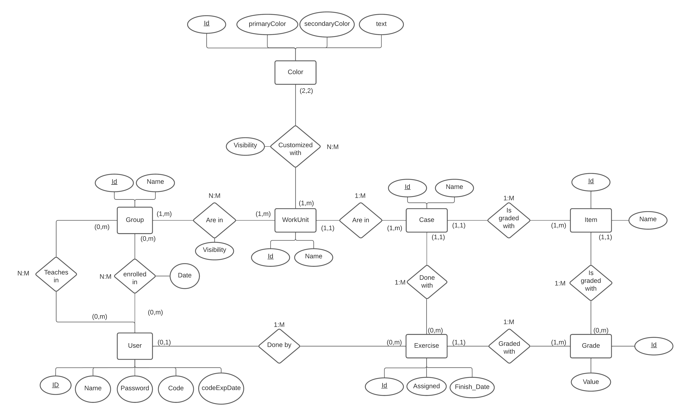

# MetaHospitalFP

<a name="readme-top"></a>

<!-- TABLE OF CONTENTS -->
<details>
  <summary>Table of Contents</summary>
  <ol>
    <li>
      <a href="#about-the-project">About The Project</a>
    </li>
    <li>
      <span>Diagrams</span>
      <ul>
        <li><a href="#use-case-diagram">Use case diagram</a></li>
        <li><a href="#class-diagram">Class diagram</a></li>
        <li><a href="#class-diagram">Entity-relation diagram</a></li>
      </ul>
    </li>
    <li><a href="#figma-prototype">Figma prototype</a></li>
    <li>
      <span>Getting started</span>
      <ul>
        <li><a href="#prerequisites">Prerequisites</a></li>
        <li><a href="#installation">Installation</a></li>
        <li><a href="#open-the-project">Open the project</a></li>
      </ul>
    </li>
    <li><a href="#contact">Contact</a></li>
  </ol>
</details>

<!-- ABOUT THE PROJECT -->
## About The Project

This project is an application about the administration of activities, the users have some roles like
students, that can complete exercises and read files and see their punctuations in the activities.
The teachers can assign activities and exercises to their students. The last user is the administrator,
he is the only user that can create cases, which will be assigned to students by their teachers and can assign students and teachers to a classroom.

The cases will be evaluated based on a set of criteria ("Items"). The criteria will be used to determine the grade
for each case.

In addition, there will be a guest user. This guest user will only be able to access public cases.
Any changes they make will not be saved to the database.

<!-- Diagrams -->
## Diagrams

### Use case diagram

<div style="text-align: center; height: fit-content; margin: 20px 0">
  
</div>

### Class diagram

<div style="text-align: center; height: fit-content; margin: 20px 0">
  
</div>

Thanks to the class diagram, we can start identifying the different
entities that need to be created to create the database. However,
we still need one last diagram, which is the Entity-Relation diagram.
Once we have that diagram ready, we can start creating the backend.

### Entity-relation diagram

<div style="text-align: center; height: fit-content; margin: 20px 0">
  
</div>

In this diagram we can identify all the necessary tables to create the databases.

Notice that we have a table that has several records, among them is the role ("Discriminator"), this
role will be the one that will identify if the user is a student, a teacher, a director or an administrator.

Finally, it is not necessary to add the guest because it can't modify the data in the database

#### Figma prototype

Once that I have a first view of the application, I can start to create the prototype, to create it I used Figma, here is the prototype. [Figma prototype]


## Getting Started

### Prerequisites

- Have a text editor like [Visual Studio Code]

- Have installed the lastest lts version of node js

you can see what version is installed with:

 ```sh
  node --version
  ```

If you don't have node js <a href='https://nodejs.org/en'>click here</a> to install it

### Installation

1. Clone the repo
   ```sh
   git clone https://github.com/JavierPadronGarcia/Neonatos.git
   ```

2. Go to the new folder and Install NPM packages for the frontend
    ```sh
    cd Neonatos/frontend
    npm install
    ```

3. Go to the backend folder and install the npm packages:

    ```sh
    cd Neonatos/backend
    npm install
    ```

4. Finnaly you need to create the .env file in the main folder in the backend:

    ```sh
    cd Neonatos/backend
    ```

You will have the folder like this:


In the .env you need to put the following lines, this are an example,

 ```sh
  JWT_SECRET= #a difficult password for the JWT token

  MYSQL_DATABASE=db_metahospitalfp
  MYSQL_USER= #your mysql user, usually is root
  MYSQL_PASSWORD= #your mysql password
  MYSQL_ROOT_PASSWORD= #the mysql root password

  DB_HOST=localhost

  NODE_ENV=development
```
Once you have all the data here, you will need to create the mysql database:

Open mysql workbench and login to your account.

Now, in the toolbar clic here to create a database 


And put the same database name that you have in the .env:


Clic on apply and you have finished the set up of the proyect.

<a name="start-the-project"></a>

### Open the project

 Now we have installed the proyect you need to start it like this:

  - Start the backend:

  To start the backend, go to the backend folder in the terminal an put this:
  ```sh
    npm start
  ```
  This command will run the server and show you something like this:
  

  And if it's the first time starting the backend it will create all the tables and relations.

  Now, mysql workbench will show all the tables created:
  

  If you want to check the created endPoints of the backend 
  <a href='https://documenter.getpostman.com/view/29809597/2s9YeD8DNB'>click here</a>

  In the link you will see all the endpoints in the database with folders for each table, if you want to see a description of the table, clic in the folder and you will see this:
  

  - Start the frontend:

  Starting the frontend is very simmilar to the backend, you only need to go to the frontend directory
  and run this command in the terminal:

  ```sh
    npm start
  ```

  Now it will start a localhost server in the port 3000 and you can start to use it:
  

<!-- CONTACT -->
## Contact

Javier Padrón García -- padrongarciajavier04@gmail.com

Project Link: [https://github.com/JavierPadronGarcia/Neonatos.git](https://github.com/JavierPadronGarcia/Neonatos.git)

<p align="right">(<a href="#readme-top">back to top</a>)</p>

<!-- URL for images and links -->

[Figma prototype]: https://www.figma.com/file/kgVO2ubTzYIx4k8zKhmsPT/Activities-Application?type=design&node-id=0%3A1&mode=design&t=GwbDayW38fcjR2gf-1

[Visual Studio Code]: https://code.visualstudio.com
[postman]: https://www.postman.com