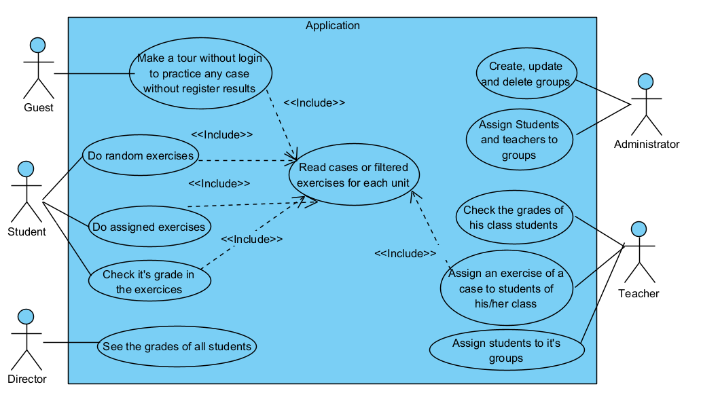

# MetaHospitalFP

<!-- TABLE OF CONTENTS -->

  
Table of Contents

  <ol>
    <li>
      <a href="#about-the-project">About The Project</a>
    </li>
    <li>
      Diagrams
      <ul>
        <li><a href="#use-case-diagram">Use case diagram</a></li>
        <li><a href="#class-diagram">Class diagram</a></li>
        <li><a href="#class-diagram">Entity-relation diagram</a></li>
      </ul>
    </li>
    <li><a href="#figma-prototype">Figma prototype</a></li>
    <li><a href="#contact">Contact</a></li>
  </ol>

<!-- ABOUT THE PROJECT -->
## About The Project

This project is an application about the administration of activities, the users have some roles like
students, that can complete exercises and read files and see their punctuations in the activities.
The teachers can assign activities and exercises to their students. The last user is the administrator,
he is the only user that can create cases, which will be assigned to students by their teachers and can assign students and teachers to a classroom.

The cases will be evaluated based on a set of criteria ("Items"). The criteria will be used to determine the grade
for each case.

In addition, there will be a guest user. This guest user will only be able to access public cases.
Any changes they make will not be saved to the database.

<!-- Diagrams -->
## Diagrams

### Use case diagram

  

### Class diagram

  

Thanks to the class diagram, we can start identifying the different
entities that need to be created to create the database. However,
we still need one last diagram, which is the Entity-Relation diagram.
Once we have that diagram ready, we can start creating the backend.

### Entity-relation diagram

  

In this diagram we can identify all the necessary tables to create the databases.

Notice that we have a table that has several records, among them is the role ("Discriminator"), this
role will be the one that will identify if the user is a student, a teacher, a director or an administrator.

Finally, it is not necessary to add the guest because it can't modify the data in the database

#### Figma prototype

Once that I have a first view of the application, I can start to create the prototype, to create it I used Figma, here is the prototype. [Figma prototype]

<!-- CONTACT -->
## Contact

Javier Padrón García -- padrongarciajavier04@gmail.com

Project Link: [https://github.com/JavierPadronGarcia/Neonatos.git](https://github.com/JavierPadronGarcia/Neonatos.git)

(<a href="#readme-top">back to top</a>)

<!-- URL for images and links -->

[Figma prototype]: https://www.figma.com/file/kgVO2ubTzYIx4k8zKhmsPT/Activities-Application?type=design&node-id=0%3A1&mode=design&t=GwbDayW38fcjR2gf-1

[Visual Studio Code]: https://code.visualstudio.com
[postman]: https://www.postman.com